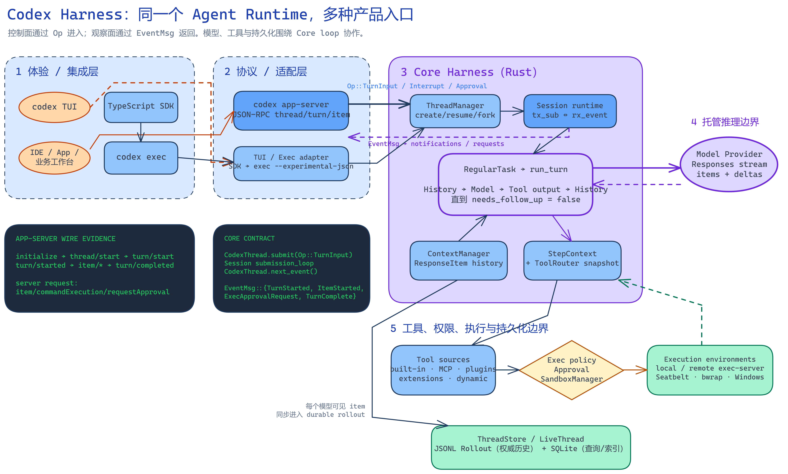
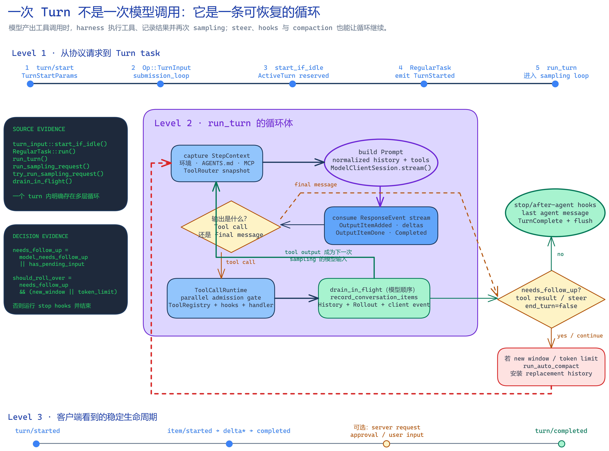
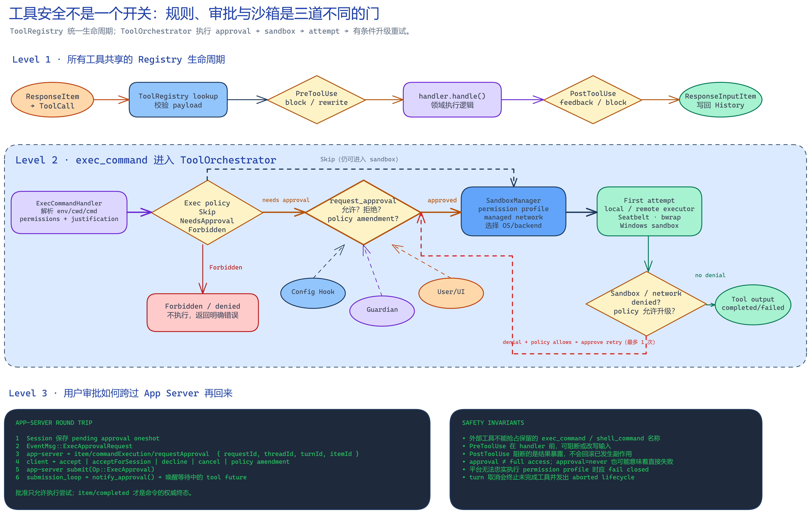

这个站的第一篇文章还没写完，目录里先躺着三张架构图。

和它们放在一起的，是7篇 Codex 源码导读。从范围边界，到系统分层，再到一次 turn 怎么跑、工具怎么过审批、上下文怎么压缩、App Server 怎么接客户端，一篇接一篇，像把一台机器的外壳慢慢拧开。

而我手边正在发生的事，刚好就是搭这个个人站。

页面要写，图片要搬，依赖要锁，命令要跑，结果要检查。中间如果出现错误，还得回到文件里继续修。把这些动作排在一起，再回头看那种最常见的理解，输入一句话，模型吐出一段答案，我突然觉得哪里不太对。

太窄了。

可把 Codex 理解成一次调用，其实很自然。我们平时看见的是输入框和回复，线程状态、工具回填、审批等待与持久化都藏在界面后面。看不见那套机器时，把屏幕上的结果当成全部，并不奇怪。

如果 Codex 只是一次模型调用，那三张图根本没有存在的必要。甚至连7篇导读都显得夸张。一个请求进去，一个响应出来，一张箭头图就讲完了，哪还需要 Thread、Session、Turn、Step、ToolRouter、Rollout 这些密密麻麻的东西。

可源码偏偏把大量力气都花在了模型外面。

这就是我想沿着这篇文章追下去的问题。Codex 真正把一段模型能力变成可用工作流的部分，到底是什么？

[OpenAI 对 harness 的正式说明](https://developers.openai.com/blog/codex-as-a-platform)给出的边界很清楚。harness 是围绕模型的执行系统，它维护对话状态，处理流式执行，调用工具，落实沙箱与审批策略，还要让工作延续到后续 turn。

注意，这里说的是围绕模型。

模型当然重要。它决定理解、推理与生成的上限。可当任务真的落到一个仓库里，光有上限还不够。谁保存上下文，谁把工具展示给模型，谁执行命令，谁处理权限，谁把结果送回去，谁在中断后恢复，全部要有人负责。

这个人不是另一个更神秘的模型。

是 harness。

边界还得再收紧一点。[OpenAI 的开源组件清单](https://learn.chatgpt.com/docs/open-source)列出了 Codex CLI、Rust Core、App Server、TypeScript SDK、协议类型与沙箱辅助组件。模型权重、托管推理服务、Codex cloud 和 IDE extension 并没有因为 harness 开源就一起变成开源代码。

所以，把这件事写成整个 Codex 产品已经全部开源，会把两层东西揉在一起。更准确的讲法是，模型与产品界面之间那套关键的 Agent 运行时和集成面，现在可以被检查，也可以被复用。模型服务与部分产品外壳仍在各自的边界里。

本文看到的当前，也不是会一直往前跑的 `main`。分析基线固定在 `openai/codex` 的 [d52478c52ef09f001142a4b82339467c3880877f](https://github.com/openai/codex/commit/d52478c52ef09f001142a4b82339467c3880877f)，抓取时间是 2026 年 8 月 25 日。后面所有源码事实，都只对这张快照负责。

这块我觉得挺重要。

源码会变，函数会搬，行号会漂。把基线钉住，文章里的判断才不是踩在流沙上。

先看第一张图。



图看着很大，但主线其实只有一条。客户端把控制请求送进去，Core 接管线程与 turn，模型和工具在循环中协作，运行状态再通过事件流回到客户端。旁边的持久化系统把真正需要恢复的东西留下来。

从源码结构看，可以把它分成四层。

最外面是体验与集成层。终端里的交互式 Codex、适合脚本的 `codex exec`、TypeScript SDK、面向富客户端的 `codex app-server`，都在这里。它们长得不一样，面对的使用场景也不一样，但没有各自重写一套 Agent 循环。

再往里是协议与适配层。Core 接收 `Op`，向外发出 `EventMsg`。App Server 又把这套内部控制面投影成 thread、turn、item 组成的产品协议。界面不需要知道 Rust 运行时的每一个细节，Core 也不用知道按钮摆在左边还是右边。

真正的复用核心在第三层。`ThreadManager` 创建、恢复和分叉线程，`Session` 代表一个已经加载的线程运行时，`submission_loop` 串行消费控制操作，`RegularTask` 管一次常规 turn，`run_turn` 让模型采样和工具结果不断往返。`ContextManager` 管模型能看到的历史，`ToolRouter` 和 `ToolRegistry` 管本轮能看到并执行的工具。

最里面也是最容易被忽略的一层，是执行边界。模型提供方、内建命令、MCP、扩展、动态工具、本机或远端环境、操作系统沙箱、JSONL rollout 和 SQLite 索引，都从不同方向接到 Core 上。

看到这里，我原来那张输入进模型，答案从另一头出来的图，已经不够用了。

更像什么呢？

更像一间正在直播的控制室。控制请求从一条线进去，观察事件从另一条线出来。中间的人会换工具，会等待批准，会记录现场，会在出错后决定是继续、压缩上下文，还是停下来。模型坐在控制室里，但控制室并不等于模型。

源码里有一个特别容易把人绕晕的命名。`Session` 是历史留下来的名字，在这张快照里，它指一个已加载 thread 的运行时，不是 App Server 的网络连接。`Thread` 是可以持久化的对话单位，`Turn` 是一次用户请求以及随后发生的工作，`Sampling` 才是一次真正发给模型并消费完整响应流的请求。

还有一个更细的 `StepContext`。

它活得很短，只覆盖一次 sampling 以及由那次响应产生的工具调用。但恰恰是这个短命的对象，守住了一条很硬的工程约束。送给模型的上下文、模型看见的工具说明、工具真正执行时使用的环境，必须来自同一份请求快照。

你想想看，如果模型看到工具 A 时用的是一套餐单，真正执行时后台刚好刷新，路由却切成了工具 B，那不是聪明不聪明的问题。那是系统自己把因果关系弄丢了。

`StepContext` 做的事看起来不热闹，却很像给每次行动拍一张现场照片。后面无论背景怎么刷新，这次响应里生出来的调用，都按当时那张照片走。

这种地方很能说明 harness 的价值。

模型擅长在可能性里做选择，运行时得保证那个选择落地时，世界没有被偷偷换掉。

再看第二张图，真正的循环在这里露出来了。



一条普通路径可以压成下面这样。

```text
turn/start
→ Op::TurnInput
→ submission_loop
→ RegularTask
→ run_turn
→ run_sampling_request
→ try_run_sampling_request
→ tool output 回填 history
→ 再次 sampling 或结束
```

客户端发起 `turn/start` 后，App Server 会把模型、工作目录、环境、审批和沙箱等覆盖项一起映射给 Core。控制输入被包装成 `Op::TurnInput`，送进 `Session` 的 submission channel。[`submission_loop`](https://github.com/openai/codex/blob/d52478c52ef09f001142a4b82339467c3880877f/codex-rs/core/src/session/handlers.rs#L514-L676) 串行接管这些操作，但不会把一个可能很长的 turn 堵在自己的分支里。它会启动一个可取消的 task，让控制循环继续有能力接收 interrupt、approval 回复和新的输入。

当线程空闲时，`start_if_idle` 会先在锁内预留 `ActiveTurn`。准备失败就清理预留状态，避免两个并发请求同时长出两条根 turn。已有活动 turn 时，新的输入也不一定新开一轮，它可以进入 pending input，成为 steer。

这已经和普通聊天接口很不一样了。

一个 turn 里，模型居然可能被叫好几次？？？

是的，而且这才是主干。

[`run_turn`](https://github.com/openai/codex/blob/d52478c52ef09f001142a4b82339467c3880877f/codex-rs/core/src/session/turn.rs#L153-L589) 会准备历史、环境、skills、plugins 和本轮工具表，然后发起 sampling。响应流里如果出现文本增量，客户端会持续收到 delta。如果出现完整的工具调用，`ToolRouter` 把不同形状的 Responses item 统一成带名称、调用 ID 和参数的 `ToolCall`，交给 registry。

工具跑完，结果不会只在界面上闪一下。它会变成模型可见的 output，写回 conversation history，再进入下一次 sampling。模型拿到真实执行结果以后，才决定继续调用、修正方案，还是给出最终回复。

所以，一次 turn 并不是一颗从提示词直线飞向答案的子弹。

它是一圈一圈转回来的。

模型提出行动，harness 执行动作，结果回到历史，模型基于新事实继续。源码会计算 `needs_follow_up`，只要模型仍需继续，或者还有 pending input，循环就不会草率收口。上下文快到边界时，它还能先 compact，再带着替换后的历史进入新窗口。

我有时候觉得，Agent 这个词被讲得太像一种性格，好像模型只要更主动一点，就忽然拥有了手脚。可从这条链路看，所谓手脚并不是一句人格提示。它是工具调用从生成、执行、回填到再次决策的完整生命周期。

缺一段都不行。

只有调用，没有结果回填，模型不知道动作发生了什么。只有结果，没有稳定顺序，后续上下文会漂。只有循环，没有取消与终态，客户端永远不知道工作到底结束没结束。

源码对工具并发的处理也很有意思。允许并行的调用拿共享读锁，不能并行的调用拿写锁，于是后者会和所有调用互斥。执行可以重叠，结果却通过 `FuturesOrdered` 按模型产生调用的顺序写回历史。[`ToolCallRuntime`](https://github.com/openai/codex/blob/d52478c52ef09f001142a4b82339467c3880877f/codex-rs/core/src/tools/parallel.rs#L41-L205) 把吞吐与确定性拆开处理，而不是二选一。

说真的，这些代码没有模型 benchmark 那么抓眼球。

可一个任务能不能稳定跑完，往往就藏在这种不抓眼球的地方。

顺着循环再往下看，会撞上另一个经常被当成聊天记录的问题，状态。

Codex 同时维护运行时状态、模型可见状态和持久化状态。当前有没有 active turn，是否有人在等审批，这是运行时状态。下一次 sampling 能看到哪些 `ResponseItem`，这是模型可见状态。可以拿来 resume、fork、列表和搜索的 rollout 与索引，则属于持久化状态。

三者有关联，但不是一个大对象随手序列化。

[`record_conversation_items`](https://github.com/openai/codex/blob/d52478c52ef09f001142a4b82339467c3880877f/codex-rs/core/src/session/mod.rs#L3138-L3193) 会把一条模型可见 item 同时送进 `ContextManager`、持久化 rollout 和观察事件。工具 output 因而不只是 UI 日志，它既是下一轮推理的因果输入，也是恢复线程时可以重建的事实。

本地实现里，JSONL rollout 更接近有序的权威历史，SQLite 更适合列表、搜索、分页与元数据查询。这是对源码职责的架构归纳，不是说每个接口永远只读其中一种存储。代码需要时也会扫描 JSONL 去修复派生元数据。

那上下文装不下怎么办？

不是把前面的消息粗暴删掉。

本地 compaction 会让模型生成摘要，挑选并截断旧用户消息，再把当前上下文与 world state 放回合适的位置。替换后的 history 会装进 `ContextManager`，同时留下 `CompactedItem` 作为可审计 checkpoint。因为摘要讲的是发生过什么，工作目录、权限、规则和执行环境讲的是现在是什么。只留前者，模型可能拿着已经过期的世界继续干活。

当然，压缩依然有损。

细节会淡，弱信号会丢，因果顺序也可能变模糊。源码因此提醒，多次 compaction 可能降低准确性，线程最好保持小而聚焦。对真实项目来说，这也给出一个很朴素的行动建议。关键事实写进文件、数据库或可查询系统，不要把一切都赌在聊天历史里。

回到这个正在搭的站，文章正文进 Markdown，依赖版本进锁文件，构建规则进配置，验收条件进测试。下次继续时，真正可靠的不是谁还记得今天聊过什么，而是这些事实已经落在仓库里。

这也是 harness 和项目工作流真正接上的地方。

接着看第三张图。



安全很容易被压成一个开关，要么允许，要么禁止。源码不是这么做的。

它把 exec policy、approval、sandbox 与 permissions 分开。执行规则判断这条操作可以跳过询问、需要批准，还是明确禁止。审批处理用户、Guardian 或 hook 是否同意这一次动作。沙箱与权限负责获准以后，进程究竟能读写哪里，能不能联网，交给哪个操作系统后端执行。

这三道门不能互相冒充。

不需要询问，不等于拥有完整权限。用户点了允许，也不等于命令已经成功。沙箱拒绝是一次运行后的证据，规则拒绝则是执行前就做出的判断。它们看起来都像失败，恢复路径却完全不同。

[`ToolOrchestrator`](https://github.com/openai/codex/blob/d52478c52ef09f001142a4b82339467c3880877f/codex-rs/core/src/tools/orchestrator.rs#L120-L529) 把这条链统一起来。它先看规则是否需要审批，再计算权限与网络状态，让 `SandboxManager` 选择执行后端。只有结果被识别为沙箱或网络边界造成的拒绝，而且策略明确允许升级时，系统才可能再次审批并重试。不是碰到非零退出码就自动把权限开大。

这块需要注意一下，批准只允许尝试。

真正的权威终态仍是工具完成事件。命令可能被允许后照样因为参数、依赖或业务条件失败。App Server 的标准顺序也是先出现 pending item，再发审批请求，客户端回复后解决 server request，随后才等 `item/completed`。

我原来会下意识把审批理解成一个弹窗。

源码把它写成了一段可以恢复的异步协议。Core 会先保存一个等待回复的 oneshot sender，再发出 `ExecApprovalRequest`。App Server 把事件翻译成服务端请求。客户端交回 accept、decline、cancel 或 policy amendment，回复再被包装成 `Op::ExecApproval`，经 submission loop 唤醒正在等待的工具 future。

模型 sampling 此时已经结束，turn 却还没结束。

它在等现实世界给答案。

这句话可能就是整套 harness 最有意思的地方。模型生成的是行动提议，系统必须等权限、环境和执行结果把提议变成事实。Agent 不是让模型假装已经做完，而是让模型接受现实世界一次又一次的反馈。

聊到这里，我突然想到控制论里那个很朴素的循环。系统并不靠一次完美判断活着，它靠感知、行动、反馈，再把反馈带回下一轮。Codex 的源码当然不是一篇控制论论文，但从工程结构看，模型 sampling、工具执行和 history 回填确实构成了这样一条闭环。

所以呢，harness 的价值不只是多装几个工具。

它把反馈变成了可继续推理的状态，把副作用放进权限边界，把等待与取消变成明确生命周期，再把整个过程投影给客户端。没有这些，模型再聪明，也只能在一段输入和一段输出之间表演完成任务。

App Server 又把这件事往产品侧推了一步。[官方文档](https://learn.chatgpt.com/docs/app-server)把它定位为 Codex 富客户端的接口。它使用双向的 JSON-RPC 语义，以 thread、turn、item 组织生命周期。客户端既接收文本 delta、状态与完成事件，也必须能回复审批、用户输入、permissions、MCP elicitation 或 dynamic tool 请求。

它不是第二套 Agent runtime。

入站请求经过 `MessageProcessor` 和各类 request processor，落到 `ThreadManager` 或 `CodexThread`。出站方向由每个已加载 thread 的 listener 等待 Core 事件，再把 `EventMsg` 映射成通知或服务端请求。Core 保留循环和执行真相，宿主应用负责界面、业务上下文、额外 consent 与业务系统里的最终记录。

这也解释了为什么接入 Codex，不该只复制一个聊天框。

如果使用场景原本就在编辑器、运营队列、审批台或业务记录旁边，更合理的做法是让 Agent 在那些对象旁边工作。聊天可以是一种入口，但 thread 的状态、item 的生命周期、审批的往返，才是 App Server 真正提供的积木。

还有个容易混淆的小点。固定快照里的 TypeScript SDK 会启动 `codex exec --experimental-json` 子进程并解析 JSONL，它和 app-server 是两条不同的适配路线。不是 SDK 里面偷偷又套了一层 app-server。[对应实现](https://github.com/openai/codex/blob/d52478c52ef09f001142a4b82339467c3880877f/sdk/typescript/src/exec.ts#L82-L199)就在固定源码里。

现在再回到开头。

为什么一个个人站的首篇文章，需要7篇导读和3张大图来解释 Codex？

因为真正需要解释的，从来不只是一声模型调用。

是一次请求怎么进入线程，是活动 turn 怎么被预留，是模型为什么会被调用多次，是工具结果怎样按稳定顺序回填，是审批为何不能冒充执行成功，是上下文满了以后怎样压缩和继续，是中断以后靠什么恢复，也是客户端如何看见这一切并参与其中。

模型决定了它能想到多远。

harness 决定了这些想法能不能在真实世界里一步一步发生。

两者不是谁替代谁。没有模型，循环里没有足够好的判断。没有 harness，判断就缺少状态、手脚、边界和记忆。Codex 的可用性，来自模型与 harness 的组合。

我自己的感受是，读源码最大的收获也不只是记住几个 Rust 类型。它会反过来改变使用方式。你会更愿意把任务写清楚，把关键事实落盘，把工具权限控制在需要的范围里，把长工作拆成能验证的阶段，也会在看到一句完成时继续追问，文件真的改了吗，测试真的过了吗，结果真的进入持久状态了吗？

这些问题听着不浪漫。

但工程就是靠它们站住的。

这个站现在也一样。暖纸底、蓝色网格线、三张架构图和这篇长文，只是读者能看到的一面。另一面是精确版本、静态构建、内容 schema、链接检查、响应式验证与一遍遍扫描。页面之所以能打开，不是因为有一句漂亮的描述，而是背后那条链真的跑通了。

三张图到这里也都响了。

第一张告诉我，模型只是运行时中的一个参与者。第二张告诉我，一个 turn 是可以继续、取消与恢复的循环。第三张告诉我，行动只有穿过规则、审批和沙箱，才有资格变成真实结果。

把它们叠在一起，Codex 才从一次回答，变成一段工作。

而这个刚刚长出骨架的个人站，也从一个空目录，变成了那段工作的第一份可见证据。
